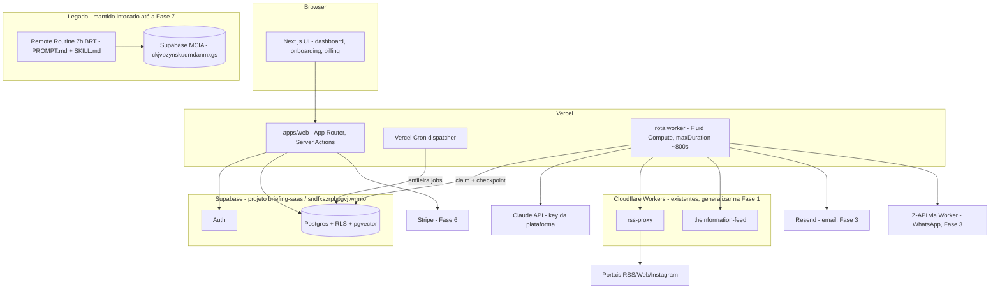

# Arquitetura — Briefing SaaS (multi-tenant)

> Documento vivo. Fase 0 estabelece fundação (tenancy, auth, RLS, CI); as fases
> seguintes preenchem os módulos indicados em [Extension points](#extension-points-fases-1-7).
> O nome "Briefing" é placeholder — única fonte: `packages/config/src/brand.ts`.

## 1. O que é o produto

SaaS de curadoria diária de notícias por IA: cada usuário configura seus portais
de referência em 3 tiers, e recebe um briefing curado (clusters pontuados por
convergência + sugestões de post) por email, WhatsApp e dashboard web. A
inteligência de curadoria vem do sistema single-user existente neste repositório
(`SKILL.md` + `references/`), que continua rodando em paralelo até a Fase 7.

## 2. Topologia alvo



Princípio herdado do legado: **serverless não fala com hosts arbitrários** — todo
fetch externo de conteúdo passa pelos Workers Cloudflare allowlistados
(`rss-proxy`; `theinformation-feed` como caso particular de fonte com credencial).

## 3. Tenancy & RLS

- Raiz: `accounts` (workspace) ← `memberships` (N:N com `auth.users`, roles
  `owner | admin | member`). v1 opera como 1 user = 1 account, mas o modelo já
  comporta times.
- Signup dispara `private.handle_new_user()` (trigger em `auth.users`): cria
  account + membership `owner` automaticamente.
- **Template canônico para toda tabela tenant futura** (documentado também em
  `supabase/migrations/20260707000003_rls_helpers_policies.sql`):

```sql
alter table public.<tabela> enable row level security;
grant select, insert, update, delete on public.<tabela> to authenticated;
grant all on public.<tabela> to service_role;

create policy <tabela>_select on public.<tabela> for select to authenticated
  using (account_id in (select private.account_ids_for_user()));
-- escrita: mesmo predicado em with check; para ações restritas a admin,
-- private.has_account_role(account_id, array['owner','admin']::public.membership_role[])
```

  Notas: o wrap em `(select ...)` vira InitPlan (1x por statement, não por linha);
  os helpers em `private.*` são `security definer` para quebrar a recursão
  policy↔memberships. **Projetos novos do Supabase não têm GRANT automático** em
  tabelas do `public` — todo migration de tabela nova precisa dos grants explícitos.
- **platform_admin não é role de membership**: tabela `platform_admins` sem
  policies e sem grant para `authenticated` — só o service role lê. Regra de ouro
  nas rotas server: `getUser()` → `requirePlatformAdmin(user.id)` → só então
  `createAdminClient()`. Bypass de RLS nunca acontece via policy.
- Fronteira da service key: `packages/db/src/admin.ts` (único arquivo autorizado;
  `import "server-only"` + check de CI `scripts/check-service-role-leak.sh`).

## 4. ADR: motor de background jobs

**Decisão: Vercel Cron + rota worker com Fluid Compute.** (confirmada com o usuário)

| Opção | Prós | Contras |
|---|---|---|
| Supabase Edge Functions + pg_cron | tudo num provedor | wall-clock ~400s; runtime Deno diverge do app; observabilidade fraca |
| **Vercel Cron + Fluid Compute** ✅ | zero infra nova; mesmo codebase/types/deploy; Fluid é feito para I/O-wait longo; maxDuration ~800s | teto ~13min/invocação; cron ≠ fila (precisa claim na tabela `jobs`) |
| Worker always-on (Railway/Fly) | sem teto de duração | 2º alvo de deploy, custo fixo, secrets duplicados — overkill para dezenas de contas |
| CF Workers + Queues | retries/DLQ nativos | 3ª plataforma no caminho crítico; compartilhar packages + service key complica |

**Frase-chave do ADR: o engine agenda e executa estágios; ele nunca é dono do
estado.** O pipeline de curadoria é stage-checkpointado (collect → cluster →
score → select → posts → deliver); cada estágio persiste resultado e avança
`jobs.stage`. Uma invocação processa estágios até ~600s e devolve o job à fila
com checkpoint salvo. Sketch da tabela `jobs` (migração na Fase 2):
`id, account_id, type, status ('queued'|'running'|'done'|'failed'), stage,
payload jsonb, attempts, run_at, locked_at, locked_by, finished_at` + unique
parcial `(account_id, type, date)` para idempotência diária. Claim via RPC com
`for update skip locked`. Migrar para worker dedicado (se o volume crescer) =
apontar um loop de polling para a mesma tabela; nenhum estágio muda.

## 5. Convenções

- **Migrações**: SQL versionado em `supabase/migrations/` (aplicar local com
  `supabase db reset`; remoto via MCP `apply_migration` ou `supabase db push`).
  Após cada migração, regenerar `packages/db/src/types.gen.ts`
  (`pnpm exec supabase gen types typescript --local`).
- **Envs**: públicas só `NEXT_PUBLIC_SUPABASE_URL` e `NEXT_PUBLIC_SUPABASE_ANON_KEY`;
  todo o resto server-only (ver `.env.example`). Segredos jamais no repo.
- **Branding**: `packages/config/src/brand.ts` é a única fonte do nome do produto.
- **i18n**: strings de UI em `apps/web/src/messages/pt-BR.json` via `next-intl`,
  locale fixo pt-BR no v1; roteamento multi-locale é extension point em
  `apps/web/src/i18n/request.ts`.
- **Testes de RLS**: Vitest + clients supabase-js autenticados contra
  `supabase start` (caminho real PostgREST+JWT). Toda tabela tenant nova entra
  em `supabase/tests/rls/`.
- **Legado intocável até a Fase 7**: `PROMPT.md`, `SKILL.md`, `context.md`,
  `references/*`, `workers/*` (a Remote Routine clona `main` e lê esses caminhos).

## 6. Princípios de produto herdados (não-negociáveis)

Universo fechado por usuário · Tier 1 canônico / Tier 2-3 sinal (Tier 3 nunca é
link recomendado) · skip por padrão em posts (💼 ≥ 2) · silêncio honesto ·
PT-BR na entrega · ≤ 1500 chars por mensagem WhatsApp · URLs limpas.

## Extension points (Fases 1-7)

1. **Fontes & ingestão resiliente**: CRUD de `sources` (tiers 1/2/3), interface
   `SourceConnector` (`RssConnector`/`WebConnector`/`InstagramConnector`),
   fetch em cascata (RSS → proxy CF → readability → só-título), `source_health_events`,
   validação na adição, biblioteca de fontes sugeridas (seed de `references/fontes.md`).
2. **Motor + memória**: porte das 9 etapas do `SKILL.md` para `packages/curation`,
   parametrizado por account; `topic_memory` com pgvector — regra novo /
   "Atualização" (com o que mudou) / suprimir; janela de memória configurável.
3. **Entrega**: Resend (React Email) + WhatsApp multi-tenant (`whatsapp_destinations`
   com **match exato** contra `contacts.phone`, grupos com sufixo `-group`, nunca
   `@g.us` — pegadinha real do worker zapi); double opt-in; `delivery_log`;
   agendamento por timezone do usuário.
4. **Dashboard**: histórico com busca full-text + semântica, timeline de assunto,
   status de fontes, configurações.
5. **Instagram connector**: API terceira (Apify ou equivalente) isolada atrás de
   `SourceConnector`, feature-flag por plano + kill-switch global em `app_config`.
6. **Billing**: Stripe Checkout/Portal/Webhooks; `plans`, `subscriptions`,
   `usage_counters`; enforcement de quota server-side antes de cada execução.
7. **Migração**: seed do account do Marcus (fontes de `fontes.md`, destinos
   WhatsApp atuais), paralelo com o cron legado, validação de paridade, sunset.
